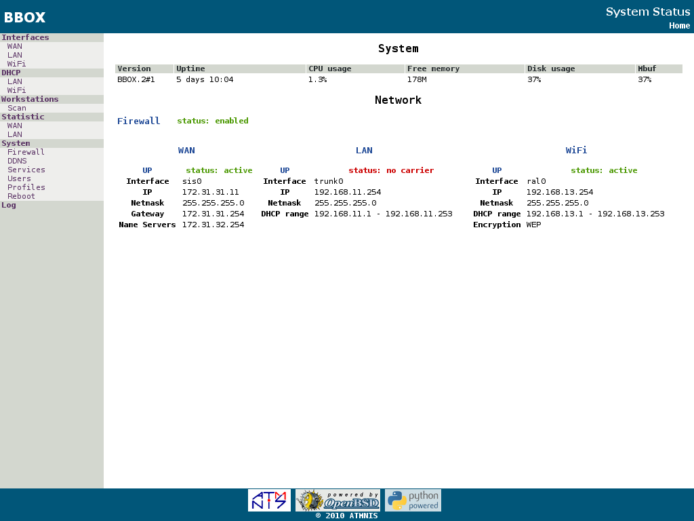
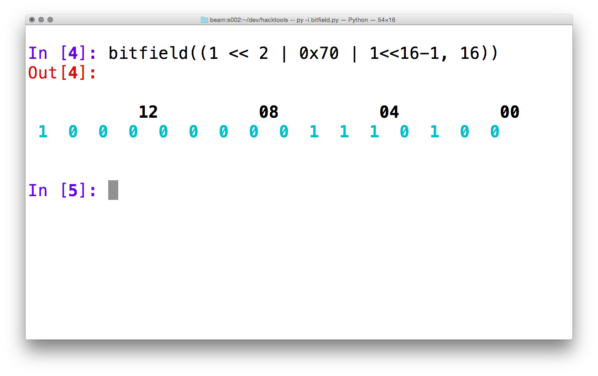
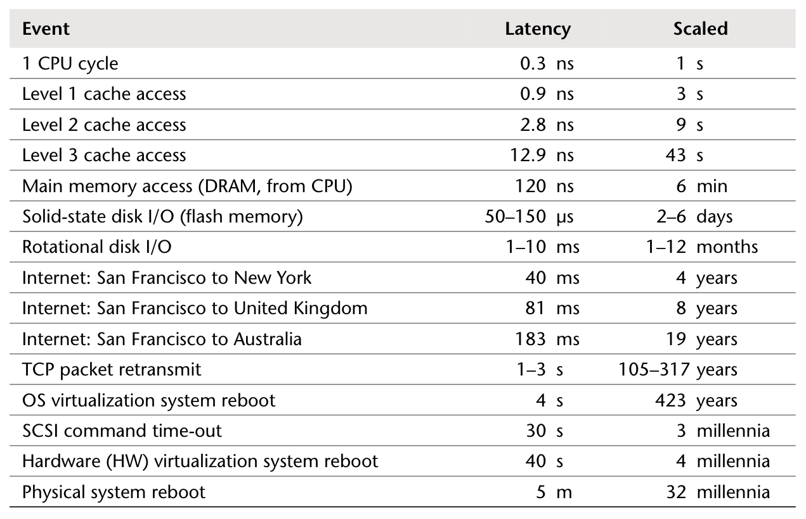
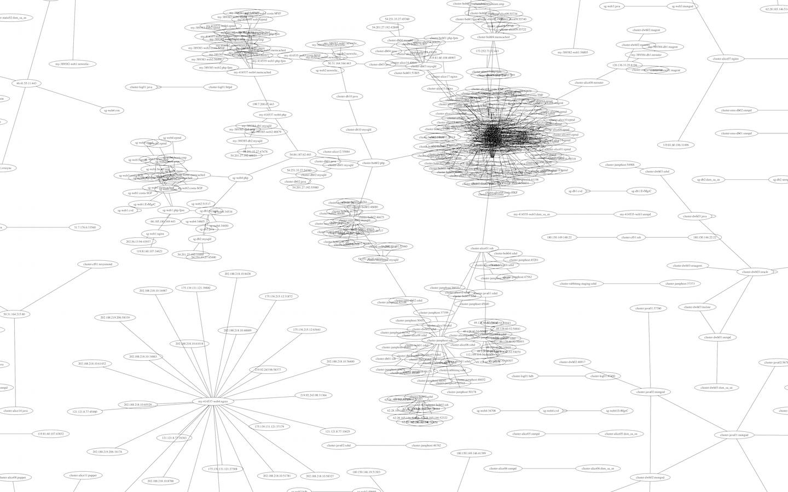
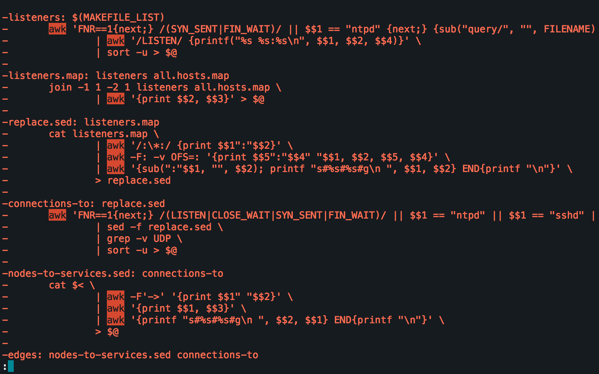
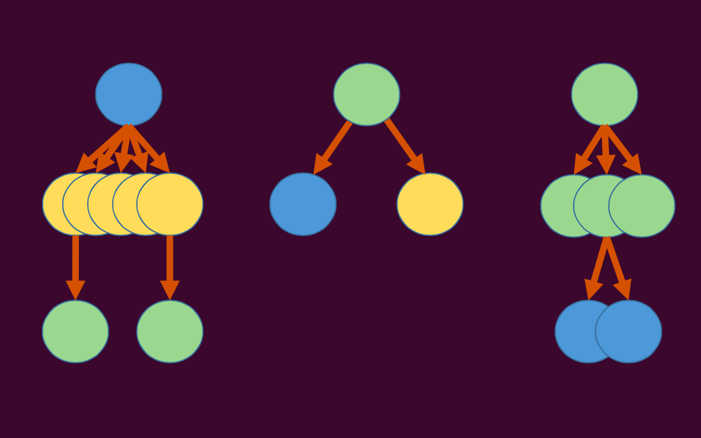

# from the first love to a serious relationship
## `pycon ukraine 2014`
### [@darkproger](http://twitter.com/darkproger)


---


# based on a true story

^ i am doing devops, doing infrastructure programming

---

# Python is awesome

^  pycon is a con about pretty much everything except python
  
---


^ use django -- your websites look cool by default

---


# zero to webapp in minutes

---



---


# complex webapps for embedded systems

---


---


# boring forms

---



---


# interactive hacking

---


# other uses

* __data robots, apparently__
* scientific computing, machine learning, etc
* desktop GUIs
* build tools, system hacking
* ad-hoc automation, scripts


---

# [fit] so why even bother looking elsewhere?

^ need for challenge; 
  will explain my motivation

---


# [fit] movember

^ Most of us take shaving for granted
  movember - men's health awareness
  you can buy shavers with lots of blades
  if you look at the history shaving was hard -- it was done with a knife and required a special person attached to it
  shaving has been democratized

---

# [fit] Democratization

^ process of a good/service to get wider audience over time; quality goes down
  prevalent; widespread

###### thank you Erik Meijer (see "Wisdom of the cloud" on TEDx Delft, 2011)

---


# [fit] Education

---


^ education (noblemen :arrow_right: universities :arrow_right: remote/internet)

---

# [fit] food
# [fit] hunting :arrow_right: growing
# [fit] :arrow_right: supermarkets

---

# [fit] abstraction
## [fit] ignoring _irrelevant_ details
### old skills become impediment in the new world

^ don't attach to old traditions
  ; people have to change the way they work
  ; consider transportation

---


---


# special human throwing coal into a big burning hole

---


---


# wheel
# pedals
## *gear stick*

---


---


# [fit] cloud computing
# [fit] distributed systems

--- 

# programming

```python
a = 1
# ...
b = {'key': 1}
# ...
c = open('/System/Library/Kernels/kernel').read()
# ...
d = requests.get(url)
```

---

# 1950's era tools

* state
* destructive assignment
* side-effects
* sequential composition

---


---

# 1950's era tools

```python
a = 1
# ...
b = {'key': 1}
# ...
c = open('/System/Library/Kernels/kernel').read()
# ...
d = requests.get(url)
```

^ started suspecting something

---



^ [Systems Performance: Enterprise and the Cloud](http://www.brendangregg.com/sysperfbook.html)

---


# stuff taking time[^!] can no longer be implicit

[^!]: [Systems Performance: Enterprise and the Cloud](http://www.brendangregg.com/sysperfbook.html)

---

# adopting a language to the new world

```python
@asyncio.coroutine
def test():
    yield from asyncio.async(create())
    yield from asyncio.async(write())
    yield from asyncio.async(close())
    yield from asyncio.sleep(2.0)
    loop.stop()
```

^ stolen from asyncio documentation

---


# [fit] python 3

^ on another note, python 3 broke everything so i became bored and walked away

---


^ my journey begins

---


---


# [fit] erlang

---


# __paradigm shift__[^1]
# process per physical entity
# language + OS

[^1]: deserves another talk really
  
^ omg i've done this with zeromq so many times!

---

# [fit] `(>>=)`

^ hear about that language (advanced calculus)
  google it

---


---


---

# `(>>=)`

* pure functions: `(+) :: Int -> Int -> Int`
* combinators: `fix f = f (fix f)`
* HOFs: `unwords . map (++ ",") . words`
* pattern matching: `case x of Just y -> y`
* ADTs:

```haskell
data Tree a = Branch a (Tree a) (Tree a)
            | Leaf
            deriving (Functor)
```

* persistent data structures

--- 


# [fit] [Lazy evaluation](http://blog.ezyang.com/2011/04/the-haskell-heap/)
# STG-machine

^ strict / eager evaluation - order of execution is bound by source code organization (call order)
  lazy - execution by evaluation order

---


# category theory

---

* functors `<$>`
* semigroups `+`
* applicatives `<*>`
* monoids `0 +`
* monads `>>=`


^ THE THREE MONAD LAWS
  
  A monad may not injure a human being or, through inaction, allow a human being to come to harm.
  A monad must obey the orders given to it by human beings, except where such orders would conflict with the First Law.
  A monad must protect its own existence as long as such protection does not conflict with the First or Second Laws.

---

> I don't use mathematics for the sake of using mathematics. The purpose behind structuring programs mathematically is to compose small bits of mathematical functionality, each of which is correct in isolation, to build larger mathematical structures which are still correct.

-- [haskellforall.com](http://www.haskellforall.com/2014/06/spreadsheet-like-programming-in-haskell.html?showComment=1402844512192#c4741783835572817187)


---

# [fit] type checker!

---


---


---


---


---


---


---

# [fit] shell


---

# [fit] haskell


---



---



---

```haskell
newtype Process = Process ByteString
newtype Host = Host ByteString
newtype Addr = Addr (IP, ByteString)

data OpenFile = Connection Host Process Addr Addr 
               | Listen Host Process Addr

data IP = IP ByteString
        | Any 

type IPMap = Map IP Host
```

---


### https://github.com/zalora/upcast

^ evaluation vs data
  money / aws

---

# DSL-driven development

* Free applicatives
* Free monads
* quasi quoting (php + sql + html + css on one page anyone?)
* template haskell
* generics

^ rich metaprogramming

---



# [fit] haxl
### https://github.com/facebook/Haxl

---

```haskell
numCommonFriends x y =
    length <$> (intersect <$> friendsOf x <*> friendsOf y)

λ :t (<*>)
(<*>) :: Applicative f => f (a -> b) -> f a -> f b
```

---

# testing

* types
* quickcheck
* can still do tdd if you like writing tests
* just ship it `:)`

---

# doing ops

* static binaries!
* `RTS` is C
* imporved IO manager in `7.8`
* lazy evaluation impedes Intel reality
    * (say something bad about callbacks here)
    * extended `DWARF` support coming in `7.10`
    * [more stuff about GHC/RTS stacks](https://github.com/blitzcode/ghc-stack)

--- 

# **community** is awesome

### you can find many (ex-)python folks there

---

# Python:
# "Easy things are easy, hard things are possible"
#
# Haskell:
# "Hard things are easy, the impossible just happened"

---

# kthxbai
## <3
